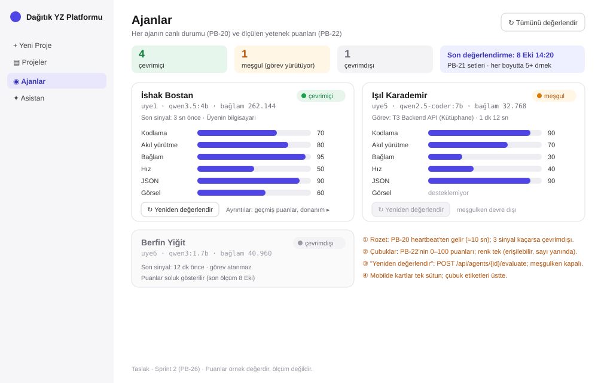

# Agents tab in Sprint 2 — design draft (PB-26)

Status: draft for Sprint 2 Planning. The team changes it there as needed.

The scores in the wireframe are example values, not measurements.

## What the tab shows

| Area | Content | Data source |
|---|---|---|
| Summary row | Number of agents online, busy and offline; time of the last evaluation | `GET /api/agents` (status from PB-20), last run of PB-22 |
| Agent card | Member, agent id, model, context window | Registration (Sprint 1) |
| Status badge | Online (green), busy (amber) with the current task, offline (grey) | Heartbeat every ~10 s (PB-20); offline after 3 missed heartbeats |
| Capability bars | Coding, reasoning, context, speed, JSON, vision, each 0–100 with the number next to the bar | Evaluation runner (PB-22) |
| "Re-evaluate" | Starts PB-22 for this agent; disabled while the agent is busy | New endpoint, e.g. `POST /api/agents/{id}/evaluate` |
| "Evaluate all" | Runs PB-22 for every online agent | Same endpoint, one call per agent |
| Details | Score history and hardware (current Sprint 1 fields) | Stored evaluation results |

## Rules

- **Offline agents.** The card is shown faded with its last scores. The selection algorithm (PB-24) does not assign tasks to offline agents, and the card says so.
- **No vision.** A model without vision shows "desteklemiyor" (not supported) instead of a bar at 0.
- **Accessible bars.** One bar colour for every dimension. The number is always printed, so the bars do not rely on colour alone.
- **Layout.** Desktop shows two cards per row. Phone and tablet below 860 px show one column, with the bar labels above the bars. This is the same breakpoint as today.
- **Refresh.** The page asks for statuses every 10 s, like the project page already does during analysis. Live updates without polling can come later.

## Questions for Sprint 2 Planning

1. Does the team want the six dimensions above? They follow `docs/architecture.md` §7 and the spot checks in [../research/model-notes.md](../research/model-notes.md).
2. Should "Evaluate all" run in the background and show progress per agent, or one agent at a time?
