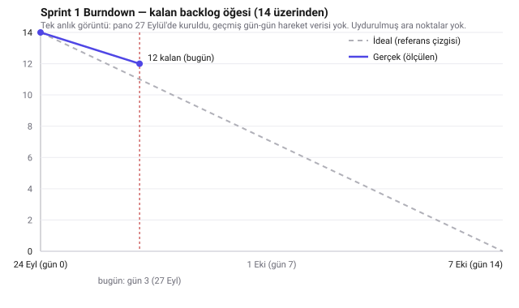

# Sprint 1 — Sprint Backlog

| | |
|---|---|
| Dates | 24 September – 7 October 2026 |
| Sprint Review + Retrospective | 7 October 2026 |
| Status | In progress (last updated 27 September 2026) |

## Sprint Goal (draft — the team confirms it at its next meeting)

> Lay the platform's foundation: documented requirements and architecture, a web interface, and a master-agent prototype that registers the team's agents and decomposes a requirements document into a dependency-ordered task plan.

No Sprint Planning record exists for this sprint in the repository. This backlog was compiled on 27 September from the course's Sprint 1 list and the work already done, so that the team can confirm or change it.

## Items

| ID | Item | Owner | Status |
|---|---|---|---|
| PB-01 | Chat assistant (now the Assistant tab) | İshak Bostan | Done — 25 Sep |
| PB-02 | Responsive layout | İshak Bostan | Done — 25 Sep |
| PB-03 | Tables and SVG diagrams in answers | İshak Bostan | In review |
| PB-04 | Software Requirements Specification | İshak Bostan | In review (PO to review) |
| PB-05 | Architecture document | İshak Bostan | In review |
| PB-06 | Platform web interface (4 tabs) | İshak Bostan | In review |
| PB-07 | Master agent prototype (API, SQLite, background analysis) | İshak Bostan | In review |
| PB-08 | Agent service and registration, staging profile | İshak Bostan | In review |
| PB-09 | Basic task decomposition | İshak Bostan | In review |
| PB-10 | Scrum artifacts | İshak Bostan | In review (Product Goal, order: PO; DoD: team) |
| PB-11 | GitHub collaboration and required CI | İshak Bostan | In progress |
| PB-12 | Trello board | İshak Bostan | In review (members still to be invited) |
| PB-13 | Tailscale network and member setup scripts | İshak Bostan | In review |
| PB-14 | Each member installs and registers their own agent | Each member | To do |

"In review" means the work is in the Sprint 1 pull request and waits for a teammate's review.

## Mid-sprint status snapshot — not the Sprint Review

Per the [Scrum honesty rule](../README.md): the Sprint Review, Retrospective and course-required
Progress Report are events tied to the end of the sprint (7 October) and are not written before
then. What follows is a plain status check-in on day 3 of 14, so the team can see where things
stand; it does not replace those end-of-sprint records.

- **Pull request:** [#1 "Sprint 1: platform foundation (PB-03 – PB-13)"](https://github.com/bostnishak/distributed-ai-dev-platform/pull/1), open, not yet merged. All three CI checks (`master`, `agent`, `docker-build`) pass. Waiting on a teammate's review (branch protection requires one approval).
- **Trello:** the board (<https://trello.com/b/VvJnXmp6>) now carries all 43 backlog cards with the same `PB-xx` IDs as `product-backlog.md`, arranged in the columns from [../README.md](../README.md). PB-11 is the only Sprint 1 item still in *Yapılıyor*: `main` is protected, `docker-build`/`master`/`agent` CI and one approval are required, and Semih, Furkan and Zeynep Duru are added as collaborators; Işıl and Berfin still need to send their GitHub usernames.
- **Burndown (single real snapshot, not a fitted trend):** . Definition-of-Done-wise, only PB-01 and PB-02 are merged to `main`; the other eleven Sprint 1 items are drafted and sitting in PR #1, so by a strict burndown they still count as remaining. 12 of 14 items remaining on day 3 is a little behind the 11-remaining idealized pace — consistent with everything being drafted but nothing else past the PR-review gate yet.
- Sample requirements document ([kutuphane-yonetim-sistemi.md](../../examples/kutuphane-yonetim-sistemi.md)) decomposed by Qwen3.5 4B on the master's CPU:
  - 44–52 s per run
  - 7 entities, 11–15 endpoints (varies between runs), 9 pages, 3 open questions
  - 16 tasks
- All six agents registered with their real context windows and capabilities: `uye1` on its own (master) computer, `uye2`–`uye6` as staging on the master computer until the members connect.
- Master: 72 unit tests pass (56 plus 16 for the assistant's calculator, code-run and CSV/XLSX support added 27 September). Agent: 13 unit tests pass. Lint is clean.
